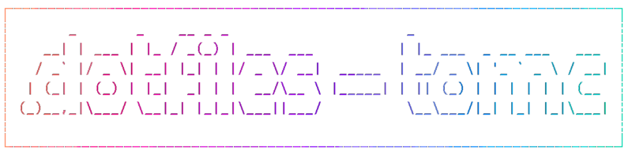

[](https://opensource.org/licenses/MIT)


# My Dotfiles

Personal dotfiles managed using [Dotbot](https://github.com/anishathalye/dotbot).  
Includes symlinks, custom configuration, and optional auto-install tools.

---

## Setup on a new machine

```bash
git clone https://github.com/tomcoolpxl/dotfiles.git ~/.dotfiles
cd ~/.dotfiles
git submodule update --init --recursive
./install
```

This will:

- Create symlinks as defined in `install.conf.yaml`
- Optionally install extra tools (see below)

---

## What's included

- `.bashrc`
- `~/.config/starship.toml`
- ...

---

## How to Add a New File to Dotbot

1. Move the original file to your dotfiles repo:
   ```bash
   mv ~/.vimrc ~/.dotfiles/vimrc
   ```

2. Edit `install.conf.yaml` and add:
   ```yaml
   ~/.vimrc: vimrc
   ```

3. Run the installer again to symlink it:
   ```bash
   ./install
   ```

---

## Tools Used

- [Dotbot](https://github.com/anishathalye/dotbot) – for declarative, minimal dotfile management
- [Starship Prompt](https://starship.rs) – fast, customizable shell prompt
- Bash

---

## Optional: Auto-install Extra Tools

Extras are installed using `install.conf.yaml` → `shell` directive.

Example snippet:
```yaml
- shell:
    - command: curl -sS https://starship.rs/install.sh | sh -s -- -y
      description: Install Starship prompt
```

Dotbot will execute this command during setup.  
You can add more like this (e.g., install packages, tools, etc.).

---

## Notes

- Feel free to fork or adapt for your own use
- I recommend reviewing the Dotbot config (`install.conf.yaml`) before running `install`
- Your home directory is never overwritten silently — all actions are defined explicitly in `install.conf.yaml`.
- Keep sensitive files out of the repo, or encrypt them.
- Backup everything with `git push`.
